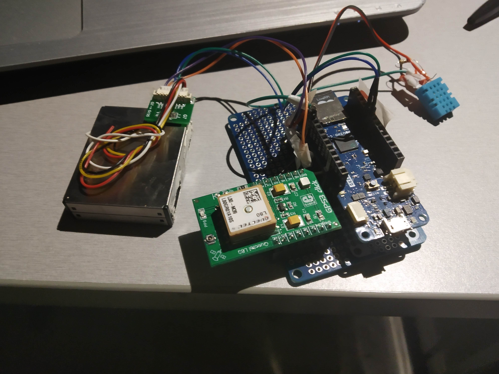
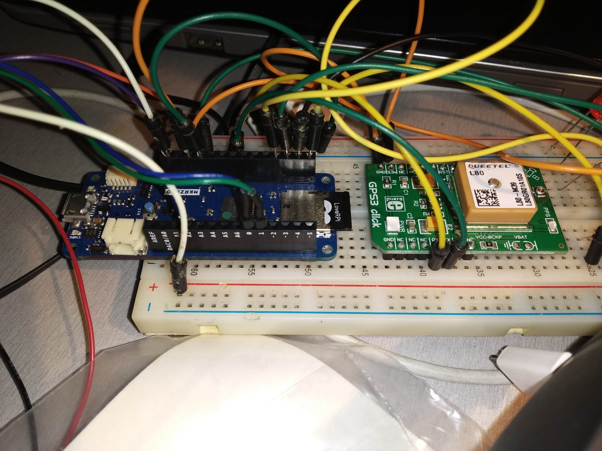

# Basic air sensor made on Arduino mkr zero, Plantower sensor 7003, DHT11 and gps module.

Arduino reads data from senors and gps then puts it to the string (called dataString) then
it writes the string to SD card.

# Connection
All devices need 3.3V power supply. Assuming all sensor and gps are powered:
1. --> GPS: 0 of MC to gps TX, 1 to gps RX
2. --> PMS7003: 13 of MC to pms TX, 14 to pms RX
3. --> DHT11: data pin of dht11 to 9 pin of MC

SD card are inserted to the slot on the board.

# Compilation
Just type "make" if you have arduino-cli installed. Then "make upload".
